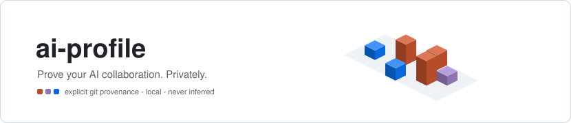
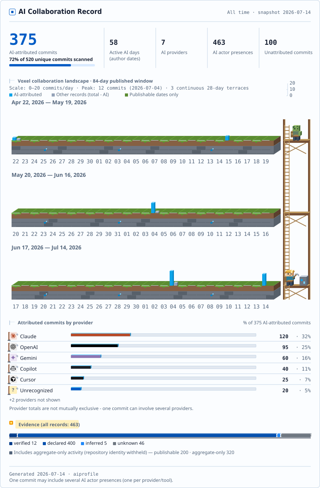
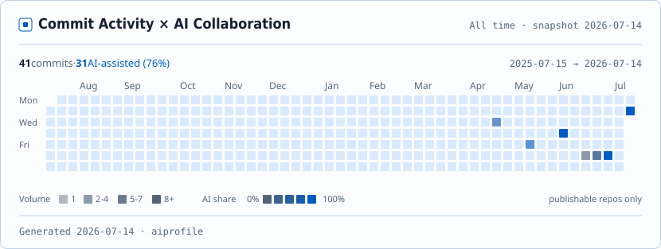

<picture>
  <source media="(prefers-color-scheme: dark)" srcset="docs/assets/banner-dark.svg">
  
</picture>

# ai-profile

[](https://pypi.org/project/ai-profile-cli/)
[](https://github.com/WenyuChiou/ai-profile/actions/workflows/ci.yml)
[](LICENSE)
[](pyproject.toml)

[English](README.md) · 繁體中文

本機優先(local-first)的 **AI 協作分析**工具,為你的 GitHub 個人頁
README 而生。`aiprofile` 掃描你本機的 Git repo,尋找*顯式的* AI 參與
證據——`AI-*` commit trailer 與已知的 AI co-author trailer(Claude
Code、Codex、Cursor、Copilot、Aider 等)——正規化為統一的事件格式
(ACE),存入本機 SQLite 資料庫,並輸出隱私安全的 SVG 卡片與 JSON
摘要,可直接嵌入 GitHub Profile README。

## 長什麼樣子

<picture>
  <source media="(prefers-color-scheme: dark)" srcset="docs/assets/summary-sample-dark.svg">
  
</picture>

<picture>
  <source media="(prefers-color-scheme: dark)" srcset="docs/assets/heatmap-sample-dark.svg">
  
</picture>

<picture>
  <source media="(prefers-color-scheme: dark)" srcset="docs/assets/badge-sample-dark.svg">
  
</picture>

範例由合成的展示用 fixture 渲染;不含任何真實 repo 資料。heatmap 是
其他工具畫不出來的視角:深淺是你完整的 commit 節奏(包含你自己寫
的),色相是每天有多少是 AI 協作。

它**不是** AI 程式碼偵測器:絕不從程式碼風格推測任何事。沒有顯式
證據的 commit 誠實地標為 `unknown`——不會被默默算成人寫的,也不會
被猜成某個 provider。

就我們所知,這是唯一免費、本機優先、跨 repo、顯式溯源的 profile
彙總工具(行級歸因屬於 git-ai 這類工具;完整分析:
[市場定位與差異化](docs/landscape.md))。

狀態:**v0.3**——v0.1 的垂直切片(單一 repo → trailer → SQLite →
彙總 → 摘要卡片)加上 provider 品牌識別(15 個 mark、雙圖標來源)、
「僅明示可發布」的等距每日日曆,以及協作比例 heatmap 與徽章。設計文件在 [`docs/`](docs/):
[架構](docs/architecture.md) · [ACE schema](docs/schema.md) ·
[MVP 邊界](docs/mvp.md) · [市場定位與差異化](docs/landscape.md)
· [決策記錄](docs/decisions/)。

## 安裝

相容性:Python 3.11–3.14 · git ≥ 2.17 · SHA-1 repo(SHA-256 物件
格式在 v0.1 會得到明確的錯誤訊息)· Windows、macOS、Linux。零執行期
依賴。

```bash
pip install ai-profile-cli
```

(PyPI 套件名是 `ai-profile-cli` 而非 `ai-profile`:PyPI 的名稱
相似度規則因無關專案 `aiprofile` 擋下了短名——注意
`pip install aiprofile` 裝到的是那個別人的專案,不是這個。)

從原始碼裝最新版:

```bash
pip install git+https://github.com/WenyuChiou/ai-profile
```

從 clone 安裝(開發用):

```bash
pip install -e ".[dev]"   # dev extras = pytest + ruff + hypothesis
```

## 快速開始

```bash
aiprofile init            # 在你自己的 repo 裡面執行——身分種子取自
                          #   該 repo 的 git config user.email
aiprofile scan ~/my/repo  # 註冊並掃描(換成真實路徑;預設即隱私安全)
aiprofile aggregate       # 印出將發布的統計 = 隱私預覽
aiprofile render          # 寫出 dist/:summary + heatmap + badge 三組
                          #   SVG(light/dark)+ profile.json
```

同一個輸出目錄**一次只跑一個 `render`**——並行渲染進同一目錄不受
支援,可能發布出來自不同掃描的混合資產。

只有你設定的身分所寫的 commit 才會被計算(init 時從
`git config user.email` 讀取;要加更多 email 就編輯
`~/.aiprofile/config.json`)。

請**在你自己的 repo 裡面**執行 `aiprofile init`:身分種子讀的是
執行當下目錄的 `git config user.email`,在不相關的資料夾執行可能
種到你的全域 email(而非你實際 commit 用的那個),或什麼都種不到。
init 之後檢查一下 `~/.aiprofile/config.json` 裡的身分。

嵌入你的個人頁 README:

```html
<picture>
  <source media="(prefers-color-scheme: dark)" srcset="dist/summary-dark.svg">
  
</picture>
```

## 宣告 AI 參與(trailer)

**如果你是透過 Claude Code、Codex、Cursor、Copilot、Aider 或 Amp
commit,多半什麼都不用做**:會自帶 co-author trailer 的工具(例如
Claude Code 的 `Co-Authored-By: Claude <noreply@anthropic.com>`)
透過已驗證的身分 registry 自動辨識。

其他情況——或想要更豐富的細節(model、角色、審查狀態)——就用
`AI-*` trailer 顯式宣告;產品名如 `Kimi`、`Claude`、`Gemini` 也能
解析:

```text
feat: add aggregation service

AI-Provider: Anthropic
AI-Model: Claude-Sonnet
AI-Tool: Claude-Code
AI-Role: implementation, documentation
AI-Mode: AI-Assisted
AI-Reviewed-By: Human
```

一個 commit 可以帶多個 **AI actor presence**
(「Claude 實作、Codex 審查」= 1 個 unique commit、2 個 presence——
這兩種指標永不混淆;presence 的意思是「這個 provider/tool 出現在
這個 commit」,所以 Claude 同時實作又審查同一個 commit 只誠實地算
一次)。完全由你自己寫的 commit:`AI-Mode: Human-Only`。

## 隱私模型(預設即安全)

- 一切留在你的機器上;無網路呼叫、無遙測。
- 每個被掃描的 repo 預設為 `aggregate_only`:它貢獻數字,永不露名。
  `scan --full` 是顯式的選擇加入,把該 repo 的數字標為「明示可發布」
  (這是你做的政策決定——**不是**對 GitHub 可見性的宣稱);
  `excluded` 則把 repo 完全移除。
- 發布政策只住在 `config.json`——改了它,下一次
  `aggregate`/`render` 就生效,不用重掃。
- 公開輸出只含:數量、provider 名稱、證據總數、一個 UTC 日期。
  永不包含:repo 名稱/路徑、組織名、分支、commit SHA 或訊息、原始
  trailer 字串、email、比日期更細的時間。未被辨識的 provider 拼法
  在公開資產中歸入「Unrecognized」桶(本機用 `aggregate -v` 可看
  原始值)。
- `aiprofile aggregate` 印出的就是會被發布的全部內容——它*就是*
  隱私預覽。
- 誠實的限制:aggregate-only 發布是**身分遮蔽,不是匿名**。repo
  名稱永不出現,但反覆發布精確數字,觀察者仍可推斷你的
  aggregate-only 活動*何時*變化、哪個 provider 出現過。完整威脅
  模型:[`docs/PRIVACY.md`](docs/PRIVACY.md)。輸出標籤是政策性的
  (「明示可發布」/「僅彙總」),永不是對 GitHub 可見性的宣稱。
- 不要把 `~/.aiprofile` 同步進公開的 dotfiles(裡面有 salt 和私有
  repo 路徑)。刪掉該目錄即刪除所有本機資料;產生的 `dist/` 檔案
  另行自行移除。POSIX 上目錄與檔案為僅擁有者可讀寫(0700/0600);
  Windows 沒有對應的權限位元,`os.chmod` 在該平台是文件化的
  no-op——資料無論如何都不離開你的機器。

## 誠實標示的指標

- **AI 參與的 commit 數**——帶有 ≥1 個顯式 AI actor presence 的
  unique commit。各 provider 的計數加總可能超過此數(多 AI 協作的
  commit),且一律標為 provider-attributed commits,永不冒充
  unique 總數。證據徽章標明其母體;百分比標明其分母;活躍天數以
  commit 作者日期計。
- **證據品質**是一級公民:`verified > declared > imported >
  inferred > unknown`。v0.1 產出 `declared`(trailer)與 `unknown`。

## 授權

MIT——見 [LICENSE](LICENSE)。歡迎依
[CONTRIBUTING.md](CONTRIBUTING.md) 貢獻。
